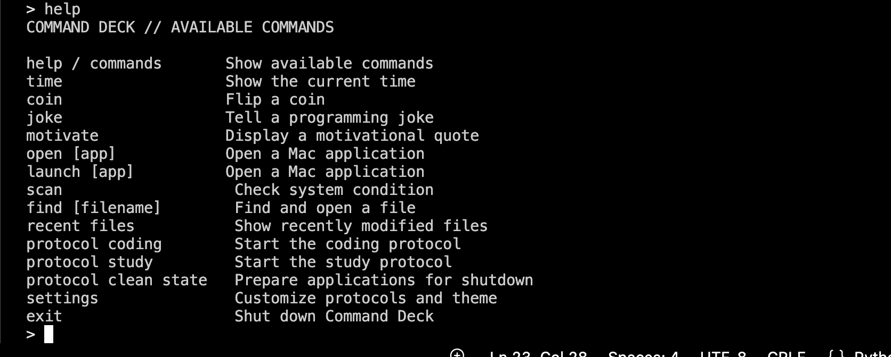

# Command Deck

A python terminal assistant that helps user control their mac from one place in a futuristic way. It turns typed commands into real Mac actions

I built this to organize commands in one place and to learn more about python.

## Why futuristic

Command Deck feels futuristic because it turns simple words into real macOS actions, allowing users to control applications, activate automated protocols, inspect their system, and find files from one command center built for the future.

## Features

It can open and close mac applications(with your permission)

- It has 3 different protocols
    - coding
    - clean-state
    - study

- It can scan your system's health and you can customize almost everything in the settings.

- It can find files and it avoids all the unnecassry stuff macOS doesn't

## Run it

- Clone this repo using:
  `git clone https://github.com/srinivasagudi0/Command-deck.git`
- Install requirements.txt
- simply run the app.py

Built by Srinivasa Gudi for future ysws (hackclub).

# Screenshots

